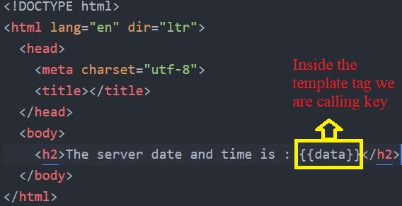
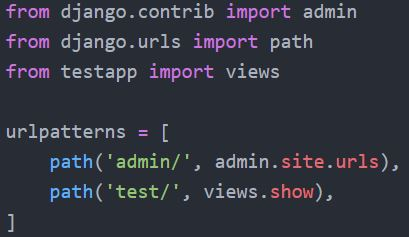
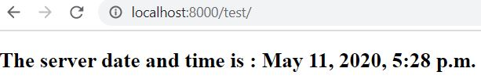
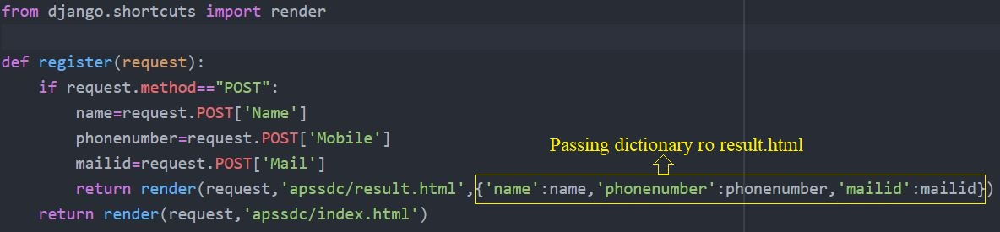
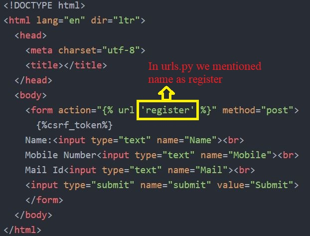
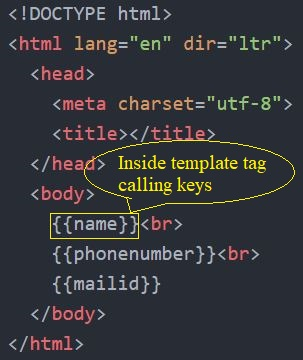
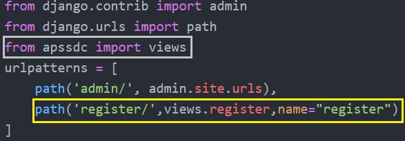
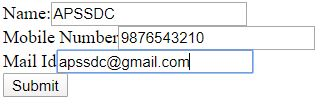
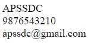

## Data Rendering From Views to Html in Static
-----
### What is a render?

It Combines a given template with a given context dictionary and returns an HttpResponse object with that rendered text.

### How to import render?

In views.py we should have to import render as follows **from django.shortcuts import render**

### How many arguments does render takes?

Render takes upto 6 argumnets i.e, Required arugumnets are 2 Optional arguments are 4

***Required Argumnets***:
  - **request**: Used to generate the response
  - **template name**: It will call the HTML Page which it is existed in the template folder

***Optional Arguments***:
  - **context**: A dictionary of values to add to the template context. By default, this is an empty dictionary. If a value in the                        dictionary is callable, the view will call it just before rendering the template.
  - **content_type**: The MIME type to use for the resulting document. Defaults to 'text/html'.
  - **status**: The status code for the response. Defaults to 200.
  - **using**: The NAME of a template engine to use for loading the template.

> How ever we will use upto 3 argumnets maximum(request,template name,context(dictionary)

***Steps to implement render from views to html and html to views***

- In views.py first we should have to import a render
- Create a view(Function) in views.py
- Create a template file(HTML File) which is to be rendered and link it to the view.
- Create a URL to map to that view

Let us create a simple template that shows the current date and time as discussed earlier we will follow those steps to get desired result.

For this project i created one application i.e, testapp is my application name and i created one function show inside the views.py, to display output i created one templated called display.html

**Views.py**
----

**display.html**
----

**urls.py**
----

**Result**
----

----

## Data rendering from html to views without using forms and models

----
***Steps as follows***

- In this we will create a simple template(html file) which includes some fields like name,Mobile Number,Mail Id
- Here total we consired 3 fields in our application so that we require 3 input fields and one submit button
- To display the output create another template

**Views.py**
----

**index.html**
----

**result.html**
----

**urls.py**
----

**Result**
----

