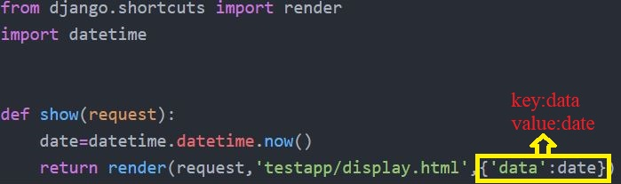

## Data Rendering From Views to Html in Static
-----
### What is a render?

It Combines a given template with a given context dictionary and returns an HttpResponse object with that rendered text.

### How to import render?

In views.py we should have to import render as follows **from django.shortcuts import render**

### How many arguments does render takes?

Render takes upto 6 argumnets i.e, Required arugumnets are 2 Optional arguments are 4

***Required Argumnets***:
  - **request**: Used to generate the response
  - **template name**: It will call the HTML Page which it is existed in the template folder

***Optional Arguments***:
  - **context**: A dictionary of values to add to the template context. By default, this is an empty dictionary. If a value in the                        dictionary is callable, the view will call it just before rendering the template.
  - **content_type**: The MIME type to use for the resulting document. Defaults to 'text/html'.
  - **status**: The status code for the response. Defaults to 200.
  - **using**: The NAME of a template engine to use for loading the template.

> How ever we will use upto 3 argumnets maximum(request,template name,context(dictionary)

***Steps to implement render from views to html and html to views***

- In views.py first we should have to import a render
- Create a view(Function) in views.py
- Create a template file(HTML File) which is to be rendered and link it to the view.
- Create a URL to map to that view

Let us create a simple template that shows the current date and time as discussed earlier we will follow those steps
```python
def show(request):
  date=datetime.datetime.now()
  return render(request,testapp/display.html,{'data':date}
```

